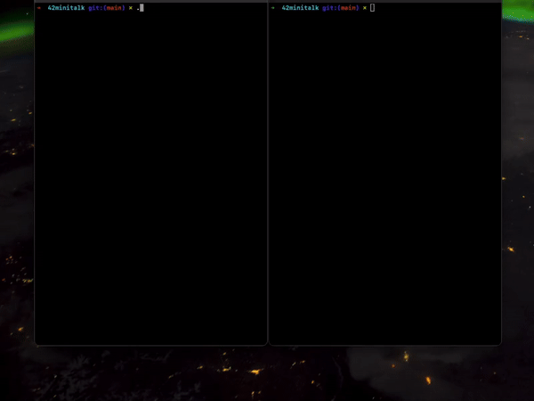

# 42minitalk

## A communications program



This is an inter-process communication program in the form of **server** and **client**.
It uses **UNIX signals** to accomplish this.
It was my fourth project in **Hive Helsinki** and it introduced **UNIX signals** and low-level **bitwise operations** for encoding data.

I actually completed this task in early **2023**, but I wanted to redo the commit history and make some minor changes.

## 📖 Topics
  - UNIX signals
  - Low-level bitwise operations

## 🛠️ Langs/Tools
  - C
  - Makefile

## 🦉 Getting started

  1. ```git clone https://github.com/kenlies/42minitalk```
  2. ```cd 42minitalk```
  3. ```make```
  5. ```./server```

  in another terminal:

  6. ```./client [server pid] [message]```
  7. repeat 6.
  

## 💸 Bonus section

The bonus of this project required support for unicode characters and server acknowledgements to the client. Overall, quite simple and elegant bonus section. Separate bonus files were not required.

## 🔨 To improve

Improvements on code modularity and structure could always be done. Better variable names?
